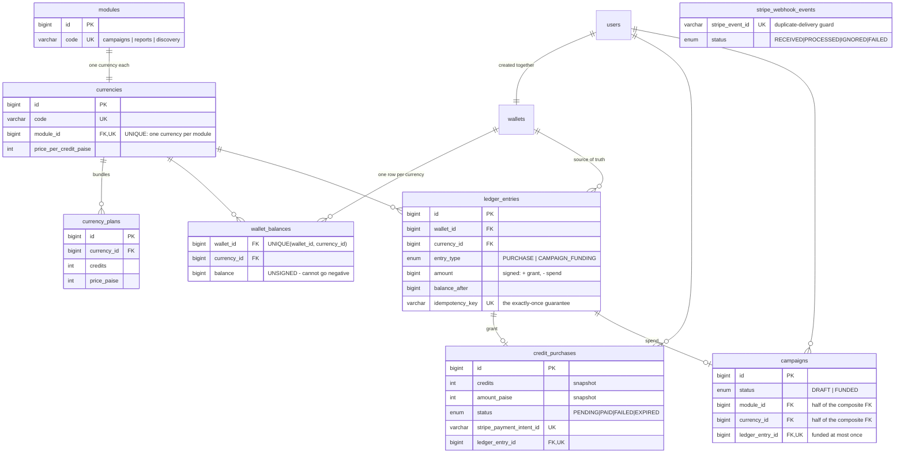

# Design

A slice of an influencer-marketing platform: users buy credits through Stripe and
spend them on campaigns. Three separate credit currencies, each bound to one module.

The happy path is small. Everything below is about what happens when Stripe retries,
the browser lies, or two requests arrive at once.

---

## Schema



### The three currencies, and the module binding

Currencies are rows, not an enum. `modules` holds `campaigns`, `reports`, `discovery`;
`currencies` holds one row per currency with a `module_id`, a `price_per_credit_paise`,
and a set of `currency_plans`. Adding a fourth currency is a seed change.

The binding is enforced twice, at two different levels:

**In code**, `assertCurrencySpendableInModule(currencyId, 'campaigns')` resolves the
currency's module and rejects a mismatch with `422 CURRENCY_NOT_ALLOWED_FOR_MODULE`.
It runs before any lock is taken, so a wrong-currency request never contends with real
traffic. Spending code never names a currency — it asks for the one bound to its module,
which is why Reports and Discovery can grow spend paths without touching the wallet or
ledger.

**In the schema**, `campaigns` stores `module_id` alongside `currency_id`, and

```sql
FOREIGN KEY (currency_id, module_id) REFERENCES currencies (id, module_id)
```

makes a cross-module spend unwritable. `UNIQUE (currencies.id, module_id)` exists purely
to be the parent index for it. MySQL skips a composite FK when any referencing column is
`NULL`, so `DRAFT` campaigns — where `currency_id` is `NULL` — are unaffected.

That second layer is the point. The service check produces the clean error message; the
constraint means no code path, present or future, can bypass the rule even by mistake.

---

## Where idempotency lives

Two layers, guarding different things.

**1. `stripe_webhook_events.stripe_event_id` is `UNIQUE`.** A redelivery — Stripe's own
retry, or `stripe events resend` — collides on insert and the handler returns `200`
without repeating the work. This layer is an optimisation.

**2. `ledger_entries.idempotency_key` is `UNIQUE`.** This is the guarantee. Every credit
movement in the system passes through it:

| Key | Movement |
|---|---|
| `purchase:<stripe_payment_intent_id>` | granting credits for a payment |
| `campaign_funding:<campaign_id>` | spending credits on a campaign |

Layer 1 alone is not enough, and this is the part worth being explicit about: **Stripe
describes one payment through more than one event.** `checkout.session.completed` and
`checkout.session.async_payment_succeeded` carry the same payment intent under different
event ids. A dedupe table keyed on the event id would process both and double-grant. The
grant key is derived from the *payment*, so the second one is a no-op.

The same index also gives "a campaign is funded at most once" for free — one mechanism,
two acceptance criteria.

Supporting constraints, all of which are exercised by
[`database-constraints.test.ts`](backend/src/tests/database-constraints.test.ts) with the
service layer bypassed entirely:

| Constraint | Prevents |
|---|---|
| `wallet_balances.balance` `BIGINT UNSIGNED` + `STRICT_ALL_TABLES` | a negative balance (underflow raises `ER_DATA_OUT_OF_RANGE`) |
| `ck_ledger_entries_amount_sign` | a `PURCHASE` that removes credits |
| `ck_campaigns_funding_consistent` | a half-funded campaign |
| `uq_campaigns_ledger_entry_id` | two campaigns sharing one spend |
| `uq_credit_purchases_payment_intent_id` | one payment backing two purchases |
| `uq_currencies_module_id` | a module with two spendable currencies |
| `ledger_entries` FKs `ON DELETE RESTRICT` | erasing history by deleting a wallet |

There is a third, request-level layer: an optional `Idempotency-Key` header on
`POST /api/credits/purchases`, unique per `(user_id, request_idempotency_key)`, so a
retried click reuses its purchase rather than creating a second payable session.

---

## Where transactions live

Two boundaries, each one `sequelize.transaction()`, both retrying on `ER_LOCK_DEADLOCK`.

**Granting credits** — [`webhook.service.ts`](backend/src/modules/stripe/webhook.service.ts),
inside `grantForSession`:

1. `SELECT ... FOR UPDATE` the `wallet_balances` row
2. insert the `ledger_entries` row (unique key)
3. `UPDATE wallet_balances SET balance = balance + :credits`
4. `UPDATE credit_purchases SET status = 'PAID', ... WHERE id = :id AND status IN ('PENDING','EXPIRED','FAILED')`

**Spending credits** — [`campaigns.service.ts`](backend/src/modules/campaigns/campaigns.service.ts),
`fundCampaign`:

1. `SELECT ... FOR UPDATE` the **campaign** row → reject unless `DRAFT`
2. `SELECT ... FOR UPDATE` the **wallet_balances** row (inside `debitWallet`)
3. check the balance → `422 INSUFFICIENT_CREDITS`
4. insert the `ledger_entries` row (unique key)
5. `UPDATE wallet_balances SET balance = balance - :credits WHERE id = :id AND balance >= :credits`, require 1 row
6. `UPDATE campaigns SET status = 'FUNDED', ... WHERE id = :id AND status = 'DRAFT'`, require 1 row

Lock order is campaign → balance, everywhere. The grant path only ever takes the balance
lock, so there is no cycle between the two.

Over-spend is blocked three times over: the row lock serialises competing spends, the
conditional `UPDATE` catches a caller that skipped the lock, and `UNSIGNED` turns an
underflow into a database error. Redundant on purpose — the outer layers give good error
messages, the inner one is what still holds when someone adds a code path in six months.

Taking the *campaign* lock first is what makes concurrent funding of one campaign resolve
cleanly: the loser waits, sees `FUNDED`, and gets a `409`. Without it, all five would race
into the ledger and collide on the idempotency key — same correctness, worse error.

The Stripe API call is deliberately **outside** any transaction. Holding a transaction open
across a network call would pin a connection and a row lock for the length of someone
else's outage.

---

## Flow: buying credits

```
POST /api/credits/purchases  →  price it from the DB  →  write PENDING purchase
                             →  create Checkout Session  →  store session id + URL
browser  →  Stripe  →  back to /checkout/return  →  polls, waits
Stripe   →  POST /api/webhooks/stripe  →  verify signature  →  grant
```

The client cannot send an amount. The server recomputes it from the currency and plan rows,
so a tampered request can ask for a different quantity but never a different price.

| Where it can fail | What happens |
|---|---|
| Session created, but the response is lost before we store the session id | The session carries `metadata.purchase_id`, so the webhook still finds its purchase. The purchase is written **before** the session exists precisely for this. |
| Session creation fails outright | Purchase marked `FAILED`. Local bookkeeping only — see below. |
| User pays, then closes the tab | Irrelevant. The webhook grants; the browser is not involved. |
| User forges `?outcome=success` | Nothing happens. The return page only polls; grants come from the webhook. |
| Forged or unsigned webhook | `400`, raised before any DB access. The route is mounted with `express.raw()` **before** `express.json()` — a JSON parser destroys the exact bytes the signature covers. |
| Same event delivered twice | `UNIQUE(stripe_event_id)` → `200`, no work. |
| One payment, two event ids | `UNIQUE(idempotency_key)` → `200`, no second grant. |
| `checkout.session.expired` arrives after payment | Expiry only transitions `WHERE status = 'PENDING'`, so a `PAID` purchase is untouched. |
| Payment settles after we marked it expired | Still granted. **A verified payment outranks local bookkeeping** — the status column is a hint, the payment is the truth. Exactly-once still holds via the ledger key. |
| Stripe collected the wrong amount | `session.amount_total` is checked against the snapshotted `amount_paise`. Mismatch → `500`, nothing granted, event recorded `FAILED`. |
| Handler throws | `500`, so Stripe retries — and the retry carries the same event id, so it cannot become a double grant. |

`credits`, `unit_price_paise` and `amount_paise` are snapshotted at purchase time. Prices
are configurable rows, so without the snapshot a later price change would retroactively
rewrite what a past payment was worth.

## Flow: funding a campaign

```
POST /api/campaigns/:id/fund  →  check currency ↔ module  →  lock campaign
                              →  lock balance  →  check  →  ledger row  →  update both
```

| Where it can fail | What happens |
|---|---|
| Report or Discovery Credits | `422 CURRENCY_NOT_ALLOWED_FOR_MODULE`, before any lock. Composite FK underneath. |
| More than the balance | `422 INSUFFICIENT_CREDITS`. Nothing written — the refused spend leaves no ledger row. |
| Two requests, one campaign | Campaign row lock: one `200`, the rest `409 CAMPAIGN_ALREADY_FUNDED`. |
| Two requests, two campaigns, not enough for both | Balance row lock serialises them: one `200`, one `422`. Balance never negative. |
| Someone else's campaign | `404` — scoped to the owner, so it is indistinguishable from a campaign that does not exist. |

---

## Acceptance criteria, and where each is proven

| Criterion | Proof |
|---|---|
| balance = Σ ledger, per currency | `expectLedgerToBalance()` in most tests; `npm run check:invariants` against live data |
| Granted exactly once per payment | `webhook-idempotency.test.ts` — same event ×5, concurrently ×5, and one payment under two event ids |
| Never granted without a confirmed payment | Unpaid session, forged signature, and "redirect grants nothing" tests |
| Each currency spent only in its module | `campaign-funding.test.ts` + the composite FK test with services bypassed |
| Balance never negative, campaign funded once | Over-spend tests (2 concurrent, then 10) + `UNSIGNED` underflow test |
| Endpoints need a valid login | `auth.test.ts` iterates every protected route |

68 tests, run against a real MySQL — not an in-memory substitute, because most of what
needs proving lives in the database. Only Stripe's *session creation* is stubbed; signature
verification uses Stripe's own `constructEvent` against payloads signed with its own
`generateTestHeaderString`.

---

## What I would improve, honestly

**Not done, and I would do it first:**

- **No frontend tests.** The React app is verified by a scripted browser pass I ran during
  development, not by a committed suite. That pass found a real bug — `GET /api/wallet`
  serialised currencies without their plans — which 67 backend tests had missed because
  none asserted on the nested payload. That is exactly the gap a component test would close.
- **Refunds.** `ledger_entries.entry_type` would take a `REFUND` value and the sign check
  would need widening. The ledger being append-only means a refund is a new row, never an
  edit — the shape is right, the code is not written.
- **Reports and Discovery spending.** Both currencies are purchasable but have no spend
  path, per the brief. `debitWallet` already takes the module as a parameter, so adding one
  is a new service plus the same composite-FK pattern on that module's table.

**Deliberate trade-offs I would revisit:**

- **The token is in `localStorage`.** It survives the Stripe redirect, which an in-memory
  token would not. It is also readable by any injected script; production wants an
  httpOnly cookie plus a refresh token.
- **Spends in one currency serialise fully**, even unrelated ones, because they contend on
  the same `wallet_balances` row. Correctness over throughput, and right at this scale.
  A busy wallet would want sharded balance rows or a queue.
- **The invariant is checked, not enforced.** `balance` is a cached projection of the
  ledger. Everything that writes it does so in the same transaction as the ledger row, and
  a script verifies it — but nothing structurally prevents a future `UPDATE` from
  desynchronising them. A generated column or a trigger would; both have costs I did not
  want to take on unexamined.
- **Webhook failures rely on Stripe's retries.** A poison event stays `FAILED` and needs a
  human. A dead-letter queue with alerting is the real answer.
- **No rate limiting** on login or signup, and no pagination beyond the ledger.
